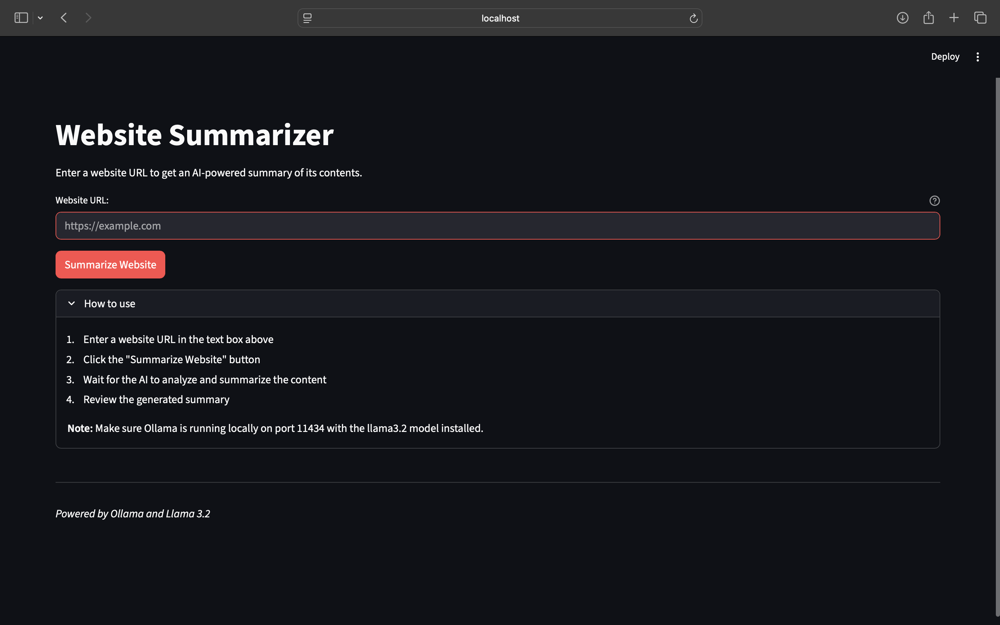

# Website Summarizer

A simple web app that scrapes any website and generates AI-powered summaries using local LLM.

## Features

- Enter any URL and get instant summary
- Clean, responsive web interface
- Filters out navigation and ads automatically
- Markdown formatted output

## Tech Stack

- **Frontend**: Streamlit
- **Web Scraping**: BeautifulSoup4, Requests
- **AI Model**: Llama 3.2 (via Ollama)
- **API**: OpenAI compatible interface

## Setup

1. Install Ollama and pull Llama 3.2:
```bash
ollama pull llama3.2
ollama serve
```

2. Install Python dependencies:
```bash
pip install streamlit openai beautifulsoup4 requests
```

3. Run the app:
```bash
streamlit run app.py
```

## Usage

1. Open the web interface
2. Paste any website URL
3. Click "Summarize Website"
4. Get AI-generated summary in seconds

## Requirements

- Python 3.8+
- Ollama running locally on port 11434
- Internet connection for web scraping




